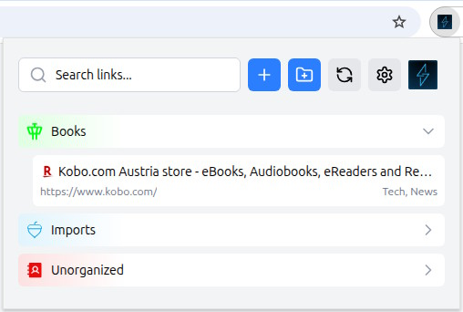

# LinkWarden Connection for Browsers

## Goal of this Extension

1. Compatibility with most major browsers (Chrome/Chromium based and Firefox; Safari may work, but is not tested)
2. View all links saved in LinkWarden through the extension with a tree structure.
3. Add/Delete/Modify all links saved in LinkWarden through the extension.
4. Add/Delete/Modify tags for each link.
5. Add/Delete/Modify folders (collections).

## Build

1. Clone the repository.
2. Run `yarn install`.
3. Run `TARGET_BROWSER=CHROME yarn build` or `TARGET_BROWSER=FIREFOX yarn build` to build the extension files.

## Installation

### Chrome

1. Build the extension
2. Open Chrome and go to `chrome://extensions`.
3. Enable Developer mode by toggling the switch in the top right corner.
4. Click on `Load unpacked` and select the `dist` folder in the cloned repository.

### Firefox

1. Download the signed addon file from the latest github release.
2. Open Firefox and go to `about:addons`.
3. Go to `Settings (gear symbol in the top right corner of the page) -> Install Add-On From File`
4. Select the `extension.xpi` file

## Demonstration

| Picture                                                          | Description                                                           |
| ---------------------------------------------------------------- | --------------------------------------------------------------------- |
|             | Options page                                                          |
|           | Popup with one folder opened   One link has tags                   |
|         | Popup with all folders opened, scrollable page   One link has tags |
|  | Hovering over a folder to show the edit and delete buttons            |
|    | Hovering over a link to show the edit and delete buttons              |
|     | Adding a new link, or editing an old one                              |

## Feature Status

| Feature                          | Status  |
| -------------------------------- | ------- |
| View all links                   | Working |
| Add/Delete/Modify links          | Working |
| Add/Delete/Modify tags for links | Working |
| Add/Delete/Modify folders        | Working |

## Integration of other Bookmark Managers

This extension is mainly built to integrate into LinkWarden, however it should be possible to port it to other bookmark managers,
like [karakeep](https://github.com/karakeep-app/karakeep), [wallabag](https://github.com/wallabag/wallabag), or others depending on the API they provide.
At least karakeep should be relatively simple to implement.

If you want to use this extension with other bookmark managers, please open an issue, and I will look into it.
